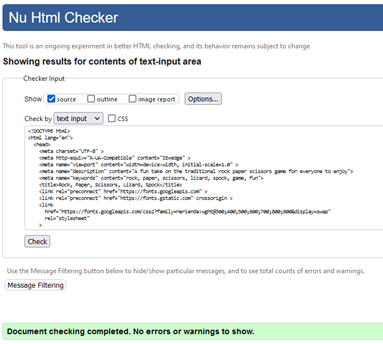
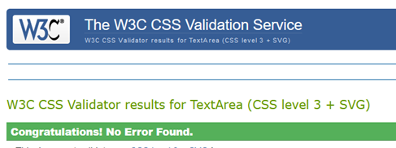

# Rock, Paper, Scissors, Lizard, Spock Game
The rock, paper, scissors, lizard, spock game is intended to be a fun, simple game for players of all ages to enjoy.

[View the project website on Github Pages](https://jayleighton.github.io/rock-paper-scissors-game/)

## Contents

- [User Experience (UX)](#user-experience-ux)
    - [User Stories](#user-stories)
        - [First Time Visitor Goals](#first-time-visitor-goals)
        - [Returning Visitor Goals](#returning-visitor-goals)
- [Design](#design)
    - [Colour Palette](#colour-palette)
    - [Imagery](#imagery)
    - [Wireframes](#wireframes)
    - [Typography](#typography)
- [Features](#features)
    - [General Features](#general-features)
    - [Accessibility]
- [Technology Stack Used](#technology-stack-used)
    - [Languages Used](#languages-used)
    - [Frameworks, Libraries, & Programs Used](#frameworks-libraries--programs-used)
- [Deployment and Local Development](#deployment--local-development)
    - [Github Pages Deployment](#github-pages-deployment)
    - [Local Development](#local-development)
        - [How to Fork the Repository](#how-to-fork-the-repository)
        - [How to Clone the Repository](#how-to-clone-the-repository)
- [Testing](#testing)
    - [Testing Tools](#testing-tools)
    - [W3C Validator](#w3c-validator)
    - [Manual Testing](#manual-testing)
    - [Resolved Bugs](#resolved-bugs)
    - [Known Bugs](#known-bugs)
    - [Performance and Accessibility Testing](#performance-and-accessibility-testing)
- [Credits](#credits)
    - [Code Credits](#code-credits)
    - [Content Credits](#content-credits)
    - [Media Credits](#media-credits)

---

## User Experience (UX)

### User Stories

#### First Time Visitor Goals
- To immediately understand the purpose of the website
- To immediately be able to start a game with no unnecessary steps
- The ability to easily access the rules of the game for new players
- To have a common experience regardless of viewport size

#### Returning Visitor Goals
- To have a common fun experience with the game

## Design

### Colour Palette

### Imagery
The imagery on the site is intended to provide an evening sky or outer space feeling because the specific game with the introduction of Lizard and Spock was made famous by a sitcom entitled [The Big Bang Theory](https://www.youtube.com/watch?v=pIpmITBocfM)

The background image for mobile screens offers a nigh sky theme and is very lightweight on bandwidth, while the larger screens will show an image of the evening sky with a higher resolution.

### Wireframes
Wireframes were created for mobile and desktop displays
- [Wireframe export](documentation/wireframs_mobile_desktop.pdf)

### Typography
Google Fonts was used to provide the following font family for the project:
- Marienda

I chose this font because it is a modern fun font, although it is a cursive font, it still makes for easy reading.

## Features

### General Features

The website consists of a single page which allows a user to start playing the game immediately.
As a result of user feedbacl, some timeout intervals have been set on the round result and game feedback to improve the user experience.

### Accessibility
Great care has been taken during the design of the game to ensure that it is as accessible as possible.
Accessbility testing has also been completed. 
Refer to the [Performance and Accessibility Testing Section](#performance-and-accessibility-testing) for more information.
  
The following has been included in the website with this in mind:

- Use of semantic HTML
- Ensuring sufficient colour contracts with the selected colour palette

## Technology Stack Used

### Languages Used
The following languages were used to create this project:

- HTML
- CSS
- JavaScript

### Frameworks, Libraries & Programs Used
- Git for version control
- Github - Used to store and save the files for the website
- [Balsamiq](https://balsamiq.com/) - For creating Wireframes
- [Code Anywhere](https://app.codeanywhere.com/) - Used as a remote development environment
- [Google Fonts](https://fonts.google.com/) - Used to import the selected fonts
- [Font Awesome](https://fontawesome.com/) - Used for the icons on the website
- [Real Favicon Generator](https://realfavicongenerator.net) - Used for the creation Favicon on the website
- Google Dev Tools - Used for troubleshooting HTML and CSS
- [Am I Responsive](https://ui.dev/amiresponsive) - To test the responsivity of the website

## Deployment & Local Development

### Github Pages Deployment

Github Pages was used to deploy the live website. The instructions follow below:

1. Log in to Github
2. Find the repository for the project
3. Click on the Settings link
4. Select Pages from the tree menu
5. Under the source option, select Deploy from a branch
6. In the Branch section, select the relevant branch
7. Click Save
8. The URL for the live site is displayed at the top of the pages section

### Local Development

#### How to fork the repository

To fork the Rock, Paper, Scissors, Lizard, Spock Repository:

1. Log in to Github
2. Go to the repository for this website, [jayleighton/rock-paper-scissors-game](https://github.com/jayleighton/rock-paper-scissors-game)
3. Select Fork at the top of the screen

#### How to clone the repository

To Clone the Rock, Paper, Scissors, Lizard, Spock repository:

1. Log in to Github
2. Got to the repository for this website, [jayleighton/rock-paper-scissors-game](https://github.com/jayleighton/rock-paper-scissors-game)
3. Click on the Code button at the top right of the screen and select HTTPS, SSH, or GitHub CLI
4. Copy the link
5. Open the terminal on your code editor in the directory where the project needs to be cloned
6. Enter 'git clone' into the terminal and paste the Github link
7. Press enter to clone the repository

## Testing
- Testing has been completed throughout the development process to ensure that all expected functionality and interactivity is working correctly before moving on to the next section of the website.

### Testing Tools

- Validation of the HTML code has also been completed successfully.

- CSS Validation has been completed at the end of the building process.

- JavaScript validation has been completed.

- Button functionality has been tested and is working as expected

### W3C Validator
The W3C validator was used to validate the HTML.

The W3C jigsaw validator was used to validate the CSS in the styles.css file.

JavaScript validation was completed using JSHint.

### Manual Testing
- Table of manual test results

### Resolved Bugs
- Instructions element causing overflow on body element. 
    - Set the element to a fixed percentage viewport height and add scrolling on overflow.
- Clicking the computer choice button triggered the game to start as a user selection.
    - Added "data-from" attribute to the buttons to identify user and computer buttons for event listeners
- Feedback was too fast after making a selection leaving the user unsure if something actually happened.
    - Added time delays to the display of the computer choice and the result to improve the user experience
- Clicking on the user buttons before the time interval passed to display components caused issues with the flow of the game
    - Added code to disable the user buttons until the result is displayed
- Unable to scroll to the result when testing with a wide, but short display
    - Correct overflow setting against the body selector causing the overflow to be hidden
- The element showing the result of the game was not noticeable at the bottom of the screen
    - Moved the element to the top of the game area for better visibility

### Known Bugs

- There are no known bugs in the current project

###  Performance and Accessibility Testing
Performance and accessibility testing has been completed using Lighthouse for both mobile and desktop displays.

- Mobile result

- Desktop result

## Credits

### Code Credits
- Code Institute
    - The button design was adapted from the Code Institute Love Maths project

- Sitepoint.com
    - The setTimeout function to delay sections of script processing was adapted from [sitepoint](https://www.sitepoint.com/javascript-settimeout-function-examples/)

### Content Credits

Content for the instructions section was obtained from the World Rock Paper Scissors Association website
[WRPSA Website](https://wrpsa.com/a-beginners-guide-to-understanding-rock-paper-scissors-lizard-spock/)

### Media Credits
- Image for mobile background by <a href="https://unsplash.com/@johnygoerend?utm_content=creditCopyText&utm_medium=referral&utm_source=unsplash">Johny Goerend</a> on <a href="https://unsplash.com/photos/galaxy-wallpaper-Oz2ZQ2j8We8?utm_content=creditCopyText&utm_medium=referral&utm_source=unsplash">Unsplash</a>
- Image for desktop screens by <a href="https://unsplash.com/@wildhoney?utm_content=creditCopyText&utm_medium=referral&utm_source=unsplash">John Fowler</a> on <a href="https://unsplash.com/photos/brown-mountain-under-starry-sky-7Ym9rpYtSdA?utm_content=creditCopyText&utm_medium=referral&utm_source=unsplash">Unsplash</a>

- [Image used to create Favicon ](https://p7.hiclipart.com/preview/1007/647/581/rock-paper-scissors-rock-paper-scissors-lizard-spock-sheldon-cooper-rockpaperscissorslizardspock-thumbnail.jpg)

